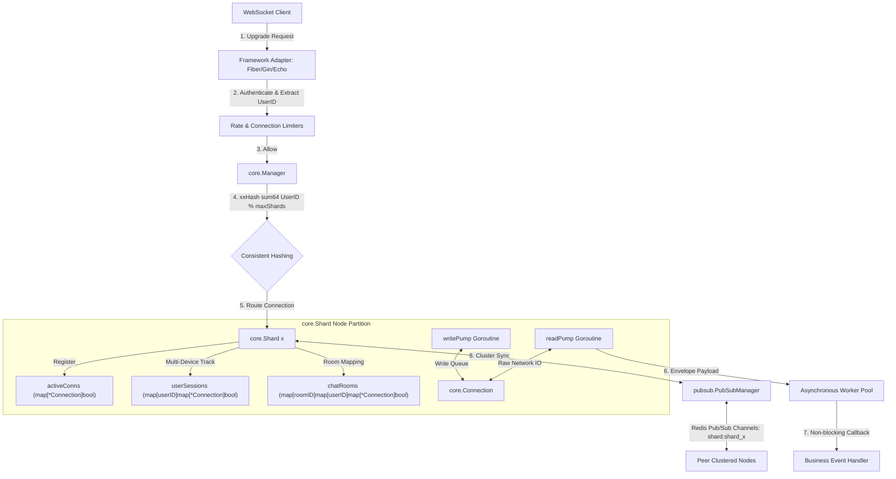

# go-common

A collection of production-ready, framework-agnostic Go packages for building backend services.

[](https://pkg.go.dev/github.com/thanhbvha/go-common)

## Packages

| Package | Description |
|---|---|
| `logger` | Async structured logger (log/slog) with optional lumberjack file rotation |
| `redis` | Redis client wrapper (single / cluster / sentinel) with health-check |
| `nats` | NATS client wrapper — Core Pub/Sub, JetStream streams/consumers, KV Store |
| `queue` | Durable Redis Streams job queue — delays, retries, DLQ, reclaim |
| `websocket` | Clustered, framework-agnostic real-time WebSocket server (Fiber / Gin / Echo) |

## Requirements

- Go 1.22+
- Redis 6.x+ (Redis 6.2+ recommended for `XAUTOCLAIM` support)
- NATS Server 2.10+ with JetStream enabled (`-js` flag or `jetstream: enabled` in config)

---

## Installation

```bash
go get github.com/thanhbvha/go-common
```

---

## logger

Zero-dependency async logger. Fiber (or any HTTP framework) adapter lives in a separate repo — no framework lock-in.

```go
import "github.com/thanhbvha/go-common/logger"

// Create with defaults (stdout, INFO level).
log := logger.New(logger.DefaultOptions())
logger.SetDefault(log)
defer logger.Close()

// Synchronous
logger.Info("server started", "port", 8080)
logger.Error("handler error", "err", err)

// Async (non-blocking, worker pool flushes in background)
logger.InfoAsync("request processed", "latency_ms", 12)
logger.WarnAsync("cache miss", "key", key)

// With file rotation (lumberjack)
log := logger.New(logger.Options{
    Level:  slog.LevelDebug,
    StdOut: true,
    File: &logger.FileOptions{
        Path:       "/var/log/myapp/app.log",
        MaxSizeMB:  50,
        MaxBackups: 7,
        MaxAgeDays: 30,
        Compress:   true,
    },
})

// Attach request-id via context
ctx = context.WithValue(ctx, logger.ContextKeyRequestID, requestID)
log.InfoWithContext(ctx, "request received", "method", r.Method)
```

### Key types

| Symbol | Description |
|---|---|
| `Options` | Top-level config (level, stdout, file, workers, buffer) |
| `FileOptions` | lumberjack rotation config (optional — nil = no file) |
| `Logger` | Struct — `Info/Error/Warn/Debug` sync; `*Async` async variants |
| `SetDefault(l)` | Register as process-wide default |
| `Default()` | Retrieve default (nil if not set) |
| `Close()` | Flush & shut down default logger |

---

## redis

```go
import "github.com/thanhbvha/go-common/redis"

// Standalone
cfg := redis.DefaultConfig()
cfg.Host     = "redis.internal"
cfg.Password = os.Getenv("REDIS_PASSWORD")
cfg.Prefix   = "myapp:"
cfg.Logger   = log // any logger.Logger-compatible value

client := redis.New(cfg)
if err := client.Connect(ctx); err != nil {
    log.Fatal(err)
}
redis.SetDefault(client)
defer redis.Close()

// Cluster
cfg.Mode         = redis.ModeCluster
cfg.ClusterAddrs = []string{"node1:6379", "node2:6379", "node3:6379"}

// Sentinel
cfg.Mode           = redis.ModeSentinel
cfg.SentinelAddrs  = []string{"sentinel1:26379"}
cfg.MasterName     = "mymaster"

// Usage
client.Set(ctx, client.BuildKey("session:abc"), data, time.Hour)
val, _  := client.Get(ctx, client.BuildKey("session:abc"))
version, _ := client.ServerVersion(ctx) // "7.2.4"
```

### Key types

| Symbol | Description |
|---|---|
| `Config` | All connection, pool, timeout, retry options |
| `ConnectionMode` | `ModeSingle` \| `ModeCluster` \| `ModeSentinel` |
| `Client` | Wraps `redis.UniversalClient`, thread-safe |
| `New(cfg)` | Allocate (does not connect) |
| `MustConnect(ctx, cfg)` | Allocate + connect, panic on error |
| `SetDefault(c)` | Register process-wide default |
| `Default()` | Retrieve default (panics if unset) |

---

## queue

Backed by Redis Streams. Supports per-type worker pools, delayed jobs, automatic retry, dead-letter queue, and stuck-job reclaiming.

```go
import "github.com/thanhbvha/go-common/queue"

cfg := queue.DefaultConfig()
cfg.Logger = log

q := queue.New(rdb, cfg) // rdb satisfies queue.RedisStreamer

// Register types (before Start)
q.RegisterJobType("email", queue.JobTypeOptions{
    Concurrency: 4,
    MaxRetry:    5,
    BatchSize:   10,
})

// Register handlers (before Start)
q.RegisterHandler("email", func(job queue.Job) error {
    // job.Data holds your payload
    return sendEmail(job.Data)
})

q.Start(ctx)
defer q.Stop()

// Immediate
q.Enqueue(ctx, "email", payload)

// Delayed
q.EnqueueDelayed(ctx, "email", payload, 30*time.Second)

// Unique / deduplicated (window: 5 min)
q.EnqueueUnique(ctx, "email", "welcome-user-42", payload, 5*time.Minute)

// Options
q.Enqueue(ctx, "email", payload,
    queue.WithMaxRetry(10),
    queue.WithDelay(5),
)
```

### Architecture

```
Enqueue ──► Redis Stream (per job type)
              │
              ▼
         Worker pool ──► handler()
              │               │
         success            error
              │               │
             ACK          retry (re-enqueue)
                               │
                          max retries exceeded
                               │
                              DLQ stream
```

| Symbol | Description |
|---|---|
| `Queue` | Central struct — owns workers, reclaimer, dispatcher |
| `Config` | All tuneable parameters with `DefaultConfig()` helper |
| `JobTypeOptions` | Per-type concurrency, retry, stream key, group override |
| `Job` | Payload envelope (ID, Type, Data, Retry, Delay, …) |
| `JobHandler` | `func(Job) error` — return non-nil to trigger retry |
| `RedisStreamer` | Interface — any Redis client satisfying it works |

---

## websocket

A high-performance, framework-agnostic, and clustered WebSocket library with support for parallel Shard sharding, asynchronous worker pools, token-bucket rate limiting, and Redis Pub/Sub cluster routing.

Includes dedicated adapters for popular Go web frameworks:
- **Fiber Adapter (`websocket/adapter/fiber`)**
- **Gin Adapter (`websocket/adapter/gin`)**
- **Echo Adapter (`websocket/adapter/echo`)**

### Core Concepts

1. **Framework-Agnostic Core (`core.Conn`):** All connections are abstracted through the `core.Conn` interface, which wraps standard `gorilla/websocket` or any custom engine.
2. **Actor-like Shard Sharding:** Connections are dynamically distributed across multiple parallel `Shard` instances using a consistent xxHash algorithm on the `userID`. Each Shard runs its own isolated message-select loop to prevent CPU lock contention.
3. **Asynchronous Processing:** Heavy computations and event handlers are offloaded to an asynchronous Goroutine worker pool, ensuring the connection's network reader is never blocked.
4. **Zero-Config Standalone Fallback:** If the Redis default client is not registered or unavailable, the clustered coordination engine seamlessly runs in standalone loopback mode.
### Architecture & Flows

The library utilizes a highly parallel, sharded architecture that isolates state to prevent CPU lock contention and scales horizontally across multiple nodes via Redis Pub/Sub.



#### Detailed Workflows

##### A. Connection Upgrade & Shard Routing
1. A client initiates a standard WebSocket handshake at `/ws?user_id=123&token=abc`.
2. The framework adapter (**Fiber**, **Gin**, or **Echo**) verifies the handshake, authenticates the query credentials, and checks rate limits and concurrent IP limits.
3. The adapter extracts the logical `userID` (e.g. `user_123`) and requests a shard assignment from the **`core.Manager`**.
4. The `Manager` performs a consistent hashing routing operation:
   $$\text{ShardIndex} = \text{xxHash.Sum64String}(\text{userID}) \pmod{\text{maxShards}}$$
5. The connection is upgrade-wrapped and registered to the corresponding **`core.Shard`**. The shard handles multi-device management automatically inside `userSessions`.

##### B. Parallel Message Pump & Event Loop
*   **`readPump` (1 per connection):** Reads raw messages from the client network socket. Upon receiving a frame, it encapsulates the bytes into an `EventMessage` and passes it to the shard's incoming message queue.
*   **Asynchronous Worker Pool:** The event dispatcher takes messages from the shard queue and submits them to a thread-safe, pre-allocated **Goroutine Worker Pool** (`pool.GetGlobalPool()`). This keeps the `readPump` completely free from heavy computational logic blocking.
*   **`writePump` (1 per connection):** Listens to a dedicated thread-safe send channel (`chan []byte`) with batch optimization. It groups multiple queued messages together before writing to the network socket, minimizing system calls.

##### C. Clustered Redis Pub/Sub Synchronization
*   When a node broadcasts a message or target event globally (e.g., `Shard.BroadcastGlobal` or `Shard.BroadcastRoomMessage`), it routes the event to its local active connections and packages the payload into a `CrossNodeMessage`.
*   The payload is published to Redis Pub/Sub via **`pubsub.PubSubManager`** over the dedicated shard channel: `shard:<shard_name>`.
*   Clustered peer instances subscribing to `shard:<shard_name>` receive the event, deserialize the envelope, and feed it into their local shard event loop, reaching target clients globally in sub-millisecond times.

### Usage Example

```go
import (
	"github.com/thanhbvha/go-common/websocket/core"
	wsFiber "github.com/thanhbvha/go-common/websocket/adapter/fiber"
	wsGin "github.com/thanhbvha/go-common/websocket/adapter/gin"
	wsEcho "github.com/thanhbvha/go-common/websocket/adapter/echo"
)

func main() {
	// 1. Register Custom Event Handlers
	core.RegisterHandler("chat_message", func(conn *core.Connection, msg core.IncomingMessage) error {
		// Process message asynchronously in worker pool
		conn.SendJSON(core.OutgoingMessage{
			Type: "chat_echo",
			Data: map[string]interface{}{"payload": string(msg.Data)},
		})
		return nil
	})

	// 2. Instantiate Adapters (Zero-arguments defaults fallback)

	// A. Fiber Adapter Setup
	fiberHandler := wsFiber.NewHandler()
	fiberServer := wsFiber.NewServer(8080, fiberHandler)
	fiberServer.SetupRoutes()
	go fiberServer.Start()

	// B. Gin Adapter Setup
	ginHandler := wsGin.NewHandler()
	r := gin.Default()
	r.GET("/ws", ginHandler.HandleUpgrade)

	// C. Echo Adapter Setup
	echoHandler := wsEcho.NewHandler()
	e := echo.New()
	e.GET("/ws", echoHandler.HandleUpgrade)
}
```

### Key types

| Symbol | Description |
|---|---|
| `core.Conn` | WebSocket connection abstraction interface |
| `core.Connection` | Active thread-safe client session (with read/write pumps) |
| `core.Shard` | Parallel communication channel (room & group routers) |
| `core.Manager` | Process-wide websocket registry & sharding distributor |
| `pubsub.PubSubManager` | Redis-backed multi-node clustered message router |
| `limiter.RateLimiter` | Generic token-bucket rate throttler |

---

## Full example

See [`example/queue/main.go`](example/queue/main.go) for a wired-up binary.

```bash
go run ./example/queue/main.go
```

See [`example/websocket/fiber/main.go`](example/websocket/fiber/main.go) for a wired-up binary.

```bash
go run ./example/websocket/fiber/main.go
```

See [`example/websocket/gin/main.go`](example/websocket/gin/main.go) for a wired-up binary.

```bash
go run ./example/websocket/gin/main.go
```

See [`example/websocket/echo/main.go`](example/websocket/echo/main.go) for a wired-up binary.

```bash
go run ./example/websocket/echo/main.go
```

---

## nats

NATS client wrapper with lifecycle management, JetStream, KV Store, and JSON helpers. API pattern mirrors the `redis` package.

### Prerequisites

```bash
# Start NATS with JetStream enabled
docker run -d --name nats -p 4222:4222 nats:latest -js
```

### Quick start

```go
import "github.com/thanhbvha/go-common/nats"

cfg := nats.DefaultConfig()
cfg.URLs   = []string{"nats://localhost:4222"}
cfg.Logger = log  // any nats.Logger-compatible value

client := nats.MustConnect(ctx, cfg)
nats.SetDefault(client)
defer nats.Close()
```

### Config reference

```go
cfg := nats.DefaultConfig()

// Connection
cfg.URLs           = []string{"nats://node1:4222", "nats://node2:4222"} // cluster
cfg.NKeyFile       = "/run/secrets/nats.nkey"   // NKey auth (optional)
cfg.CredFile       = "/run/secrets/app.creds"   // Creds auth (optional)
cfg.ConnectTimeout = 5 * time.Second
cfg.ReconnectWait  = 2 * time.Second
cfg.MaxReconnects  = 60   // -1 = unlimited

// JetStream defaults
cfg.DefaultStorage  = nats.MemoryStorage  // or nats.FileStorage
cfg.DefaultReplicas = 1                   // set > 1 for HA clusters
```

### Core Pub/Sub

```go
// Subscribe
sub, _ := client.Subscribe("events.user", func(msg *gonats.Msg) {
    fmt.Println("received:", string(msg.Data))
})
defer client.Unsubscribe(sub)

// Publish
_ = client.Publish("events.user", []byte(`{"action":"login"}`))

// JSON shorthand
_ = client.PublishJSON("events.user", map[string]any{"action": "login"})

// Queue subscribe (competing consumers / load-balanced)
q, _ := client.QueueSubscribe("tasks.>", "worker-pool", handler)

// Request/Reply
reply, _ := client.Request(ctx, "rpc.ping", []byte("ping"))
```

### JetStream – Stream & Consumer management

```go
// Create stream  (≈ XGROUP CREATE ... MKSTREAM)
_ = client.AddStream(ctx, "ORDERS", []string{"orders.>"},
    nats.WithRetention(nats.WorkQueuePolicy),  // delete on ACK
    nats.WithMaxMsgs(1_000_000),
    nats.WithMaxAge(7 * 24 * time.Hour),
    nats.WithStorage(nats.FileStorage),        // override default
)

// Create durable consumer  (≈ XGROUP CREATE)
_ = client.AddConsumer(ctx, "ORDERS", "order-svc",
    nats.WithAckWait(30 * time.Second),
    nats.WithMaxDeliver(5),
)

// Stream info  (≈ XLEN / XINFO STREAM)
info, _ := client.GetStreamInfo(ctx, "ORDERS")
fmt.Println(info.Msgs, info.LastSeq)

// Consumer info  (≈ XPENDING / XINFO GROUPS)
ci, _ := client.GetConsumerInfo(ctx, "ORDERS", "order-svc")
fmt.Println(ci.NumPending, ci.NumAckPending)

// List consumers  (≈ XINFO CONSUMERS)
consumers, _ := client.ListConsumers(ctx, "ORDERS")
```

### JetStream – Publish  (≈ XADD)

```go
// Raw bytes
ack, _ := client.JSPublish(ctx, "orders.new", payload)
fmt.Println("seq:", ack.Sequence)

// JSON shorthand
ack, _ = client.JSPublishJSON("orders.new", order)

// Async (fire-and-check)
future, _ := client.JSPublishAsync("orders.new", payload)
select {
case ack := <-future.Ok():
    fmt.Println("ack seq:", ack.Sequence)
case err := <-future.Err():
    log.Println("publish failed:", err)
}
```

### JetStream – Pull Subscribe (≈ XREADGROUP pull / BLOCK)

```go
ps, _ := client.PullSubscribe("orders.>", "order-svc")
defer ps.Unsubscribe()

// Fetch up to 10, block for up to 5s
msgs, _ := client.Fetch(ps, 10, nats.WithFetchTimeout(5*time.Second))
for _, msg := range msgs {
    var order Order
    _ = msg.DecodeJSON(&order)  // JSON helper
    
    if err := process(order); err != nil {
        _ = msg.NakWithDelay(10 * time.Second) // retry after 10s  (≈ XCLAIM)
        continue
    }
    _ = msg.Ack()  // (≈ XACK)
}

// Non-blocking fetch
msgs, _ = client.FetchNoWait(ps, 10)
```

### JetStream – Push Subscribe (≈ XREADGROUP push mode)

```go
// Individual push consumer
sub, _ := client.JSSubscribe("orders.>", "order-svc",
    func(msg *nats.Msg) {
        _ = process(msg)
        _ = msg.Ack()
    },
    nats.WithManualAck(),
)

// Queue / competing consumers (multiple workers sharing one durable)
for i := 0; i < 3; i++ {
    workerID := i
    client.JSQueueSubscribe("orders.>", "order-workers", "order-svc",
        func(msg *nats.Msg) {
            fmt.Printf("worker %d processing seq=%d\n", workerID, msg.Sequence)
            _ = msg.Ack()
        },
        nats.WithManualAck(),
    )
}
```

### Message ACK / NAK

| Method | Equivalent | Description |
|---|---|---|
| `msg.Ack()` | `XACK` | Acknowledge – remove from pending |
| `msg.Nak()` | – | Redeliver immediately |
| `msg.NakWithDelay(d)` | `XCLAIM` | Redeliver after delay d |
| `msg.Term()` | Dead-letter | Discard permanently (MaxDeliver reached) |
| `msg.InProgress()` | – | Reset AckWait timer (long processing) |

### KV Store

```go
// Create bucket  (TTL = per bucket, History = revisions per key)
_ = client.KVCreate(ctx, "config",
    nats.WithKVHistory(5),
    nats.WithKVTTL(24 * time.Hour),
    nats.WithKVStorage(nats.FileStorage),
)

// CRUD
rev, _ := client.KVPut(ctx, "config", "theme", []byte("dark"))
entry, _ := client.KVGet(ctx, "config", "theme")
fmt.Println(string(entry.Value), "rev:", entry.Revision)

// JSON helpers
_, _ = client.KVPutJSON("config", "ui", AppConfig{Theme: "dark"})
var cfg AppConfig
_ = client.KVGetJSON("config", "ui", &cfg)

// Set only if not exists  (≈ Redis SET NX)
_, err := client.KVCreate2(ctx, "config", "theme", []byte("light"))
// → error if key already exists

// Optimistic locking
current, _ := client.KVGet(ctx, "config", "theme")
newRev, err := client.KVUpdate(ctx, "config", "theme", []byte("light"), current.Revision)
// → error if a concurrent write changed the revision

// Watch – real-time change notifications (no Redis equivalent, needs Pub/Sub manually)
watcher, _ := client.KVWatch(ctx, "config", "theme")
defer watcher.Stop()
for entry := range watcher.Updates() {
    if entry == nil { continue } // initial value sentinel
    fmt.Printf("changed: %s op=%v\n", string(entry.Value()), entry.Operation())
}

// History
history, _ := client.KVHistory(ctx, "config", "theme") // requires History > 1
for _, h := range history {
    fmt.Printf("rev=%d value=%s\n", h.Revision, string(h.Value))
}

// All keys
keys, _ := client.KVKeys(ctx, "config")

// Delete
_ = client.KVDeleteKey(ctx, "config", "theme")   // soft delete (history preserved)
_ = client.KVPurgeKey(ctx, "config", "theme")    // hard delete (wipes history)
_ = client.KVDeleteBucket(ctx, "config")         // drop entire bucket
```

### Stream options reference

| Option | Description |
|---|---|
| `WithRetention(r)` | `LimitsPolicy` \| `WorkQueuePolicy` \| `InterestPolicy` |
| `WithStorage(s)` | `MemoryStorage` (default) \| `FileStorage` |
| `WithMaxMsgs(n)` | Max messages before oldest is removed |
| `WithMaxBytes(n)` | Max total bytes |
| `WithMaxAge(d)` | Max message age |
| `WithReplicas(n)` | Replication factor (requires cluster) |
| `WithDuplicateWindow(d)` | Dedup window using `Nats-Msg-Id` header |

### Consumer options reference

| Option | Description |
|---|---|
| `WithAckWait(d)` | Redelivery timeout (≈ XClaim idle threshold) |
| `WithMaxDeliver(n)` | Max delivery attempts (-1 = unlimited) |
| `WithMaxAckPending(n)` | Max in-flight messages |
| `WithDeliverPolicy(p)` | `DeliverAll` \| `DeliverLast` \| `DeliverNew` \| `DeliverByStartSeq` |
| `WithStartSequence(seq)` | Start from sequence (≈ XRANGE start) |
| `WithFilterSubject(s)` | Filter to specific subject within stream |

### Examples

```bash
# Requires: docker run -d --name nats -p 4222:4222 nats:latest -js
go run examples/nats/01_pubsub/main.go          # Pub/Sub + Queue + Request/Reply
go run examples/nats/02_jetstream/main.go        # Stream + Publish + Pull + Ack/Nak/Term
go run examples/nats/03_consumer_group/main.go   # Push queue subscribe + ListConsumers
go run examples/nats/04_kv_store/main.go         # KV CRUD + Watch + History + optimistic lock
go run examples/nats/05_json_helpers/main.go     # JSPublishJSON + DecodeJSON + KVPutJSON/KVGetJSON
```

### Key types

| Symbol | Description |
|---|---|
| `Config` | All connection and JetStream default options |
| `StorageType` | `MemoryStorage` \| `FileStorage` |
| `RetentionPolicy` | `LimitsPolicy` \| `WorkQueuePolicy` \| `InterestPolicy` |
| `Client` | Thread-safe wrapper — Core + JetStream + KV |
| `New(cfg)` | Allocate (does not connect) |
| `MustConnect(ctx, cfg)` | Allocate + connect, panic on error |
| `SetDefault(c)` / `Default()` | Process-wide singleton |
| `StreamInfo` | Simplified JetStream stream state |
| `ConsumerInfo` | Simplified consumer state (NumPending ≈ XPENDING) |
| `Msg` | Wrapped message with `.Ack/.Nak/.NakWithDelay/.Term/.InProgress` |
| `PullSubscription` | Handle for pull-based fetch |
| `PubAck` | Publish confirmation (Stream, Sequence, Duplicate) |
| `KVEntry` | KV record (Key, Value, Revision, Operation) |

---

## License

MIT
