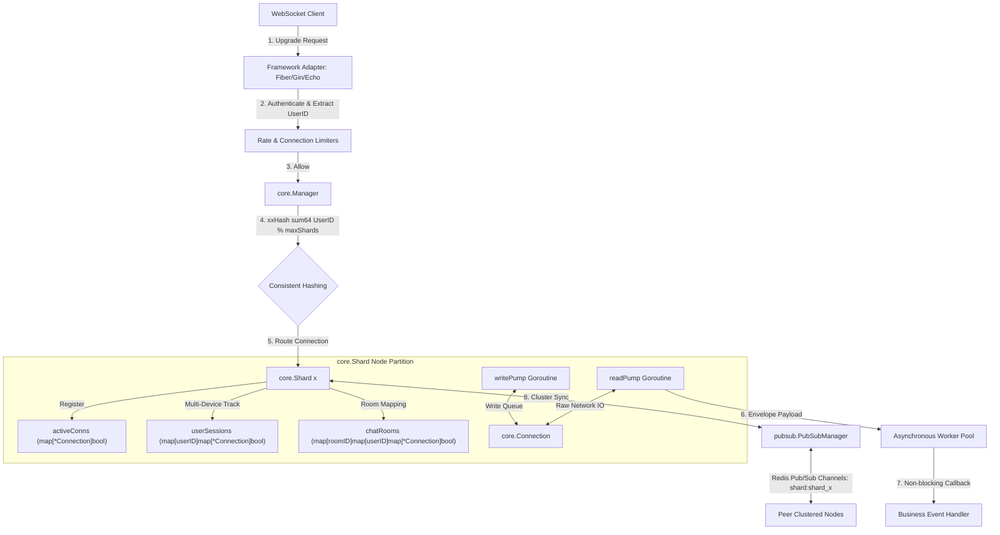

# websocket

A high-performance, framework-agnostic, and clustered WebSocket library with support for parallel Shard sharding, asynchronous worker pools, token-bucket rate limiting, and Redis Pub/Sub cluster routing.

Includes dedicated adapters for popular Go web frameworks:
- **Fiber Adapter (`websocket/adapter/fiber`)**
- **Gin Adapter (`websocket/adapter/gin`)**
- **Echo Adapter (`websocket/adapter/echo`)**

### Core Concepts

1. **Framework-Agnostic Core (`core.Conn`):** All connections are abstracted through the `core.Conn` interface, which wraps standard `gorilla/websocket` or any custom engine.
2. **Actor-like Shard Sharding:** Connections are dynamically distributed across multiple parallel `Shard` instances using a consistent xxHash algorithm on the `userID`. Each Shard runs its own isolated message-select loop to prevent CPU lock contention.
3. **Asynchronous Processing:** Heavy computations and event handlers are offloaded to an asynchronous Goroutine worker pool, ensuring the connection's network reader is never blocked.
4. **Zero-Config Standalone Fallback:** If the Redis default client is not registered or unavailable, the clustered coordination engine seamlessly runs in standalone loopback mode.
### Architecture & Flows

The library utilizes a highly parallel, sharded architecture that isolates state to prevent CPU lock contention and scales horizontally across multiple nodes via Redis Pub/Sub.



#### Detailed Workflows

##### A. Connection Upgrade & Shard Routing
1. A client initiates a standard WebSocket handshake at `/ws?user_id=123&token=abc`.
2. The framework adapter (**Fiber**, **Gin**, or **Echo**) verifies the handshake, authenticates the query credentials, and checks rate limits and concurrent IP limits.
3. The adapter extracts the logical `userID` (e.g. `user_123`) and requests a shard assignment from the **`core.Manager`**.
4. The `Manager` performs a consistent hashing routing operation:
   $$\text{ShardIndex} = \text{xxHash.Sum64String}(\text{userID}) \pmod{\text{maxShards}}$$
5. The connection is upgrade-wrapped and registered to the corresponding **`core.Shard`**. The shard handles multi-device management automatically inside `userSessions`.

##### B. Parallel Message Pump & Event Loop
*   **`readPump` (1 per connection):** Reads raw messages from the client network socket. Upon receiving a frame, it encapsulates the bytes into an `EventMessage` and passes it to the shard's incoming message queue.
*   **Asynchronous Worker Pool:** The event dispatcher takes messages from the shard queue and submits them to a thread-safe, pre-allocated **Goroutine Worker Pool** (`pool.GetGlobalPool()`). This keeps the `readPump` completely free from heavy computational logic blocking.
*   **`writePump` (1 per connection):** Listens to a dedicated thread-safe send channel (`chan []byte`) with batch optimization. It groups multiple queued messages together before writing to the network socket, minimizing system calls.

##### C. Clustered Redis Pub/Sub Synchronization
*   When a node broadcasts a message or target event globally (e.g., `Shard.BroadcastGlobal` or `Shard.BroadcastRoomMessage`), it routes the event to its local active connections and packages the payload into a `CrossNodeMessage`.
*   The payload is published to Redis Pub/Sub via **`pubsub.PubSubManager`** over the dedicated shard channel: `shard:<shard_name>`.
*   Clustered peer instances subscribing to `shard:<shard_name>` receive the event, deserialize the envelope, and feed it into their local shard event loop, reaching target clients globally in sub-millisecond times.

### Usage Example

```go
import (
	"github.com/thanhbvha/go-common/websocket/core"
	wsFiber "github.com/thanhbvha/go-common/websocket/adapter/fiber"
	wsGin "github.com/thanhbvha/go-common/websocket/adapter/gin"
	wsEcho "github.com/thanhbvha/go-common/websocket/adapter/echo"
)

func main() {
	// 1. Register Custom Event Handlers
	core.RegisterHandler("chat_message", func(conn *core.Connection, msg core.IncomingMessage) error {
		// Process message asynchronously in worker pool
		conn.SendJSON(core.OutgoingMessage{
			Type: "chat_echo",
			Data: map[string]interface{}{"payload": string(msg.Data)},
		})
		return nil
	})

	// 2. Instantiate Adapters (Zero-arguments defaults fallback)

	// A. Fiber Adapter Setup
	fiberHandler := wsFiber.NewHandler()
	fiberServer := wsFiber.NewServer(8080, fiberHandler)
	fiberServer.SetupRoutes()
	go fiberServer.Start()

	// B. Gin Adapter Setup
	ginHandler := wsGin.NewHandler()
	r := gin.Default()
	r.GET("/ws", ginHandler.HandleUpgrade)

	// C. Echo Adapter Setup
	echoHandler := wsEcho.NewHandler()
	e := echo.New()
	e.GET("/ws", echoHandler.HandleUpgrade)
}
```

### Key types

| Symbol | Description |
|---|---|
| `core.Conn` | WebSocket connection abstraction interface |
| `core.Connection` | Active thread-safe client session (with read/write pumps) |
| `core.Shard` | Parallel communication channel (room & group routers) |
| `core.Manager` | Process-wide websocket registry & sharding distributor |
| `pubsub.PubSubManager` | Redis-backed multi-node clustered message router |
| `limiter.RateLimiter` | Generic token-bucket rate throttler |
